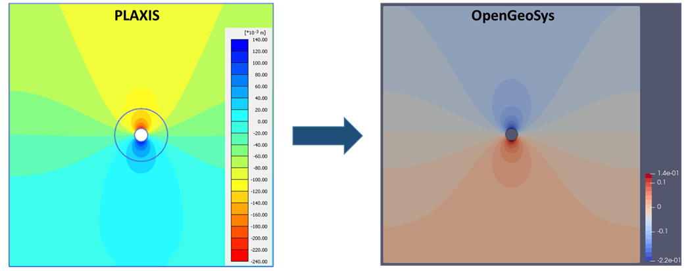
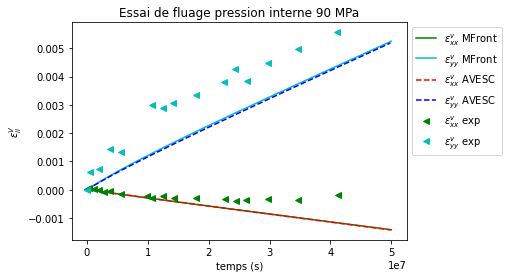

# Overview of `TFEL-4.0`.

- Thomas Helfer

# Development of a Novel Damage Model for Concrete Subjected to Creep

- Alexandre Gangnant
  - Sixense necs, Sceaux, France 
- Michel Sagno
  - Sixense necs, Sceaux, France 
- Jefri Draup
  - EDF Energy R&D UK Centre, Manchester, UK 
- Thomas Helfer
  - CEA, DEN/DEC/SESC, Département d’Études des Combustibles, France 

Concrete exhibits visco-plastic behaviour when subjected to high
temperature whilst supporting an external load; this component of
plasticity is referred to as load induced thermal strain (LITS), which
is also known as transient thermal creep (TTC). LITS phenomena can be
important in pre-stressed concrete structures. Indeed, this can
potentially lead to a loss in pre-stress, and also residual tensile
stress development under transient thermal conditions. Hence, structures
which have been subjected to a high temperature thermal loading cycle
may experience cracking and subsequent loss of rigidity; this could
ultimately lead to a loss of functionality or even structural failure.
In addition to that, under pre-stressed structures, basic creep effects
might be observed in concrete and could contribute to the failure .

Thus, in a process of catching physical & mechanical phenomena that
could occur during the lifetime of a concrete structure (e.g.
Pre-stressed concrete vessel of an AGR), a novel model has been
developed in order to take into account the damage, creep and LITS
phenomena.

Firstly, a damage model (named FLB based on Mazars) coupled with LITS
model has been developed using Mfront and tested. Secondly, basic creep
has been added to this initial constitutive law. This latter coupled
model is based on simple viscoelastic creep model (Burger) in a
framework a quasi-brittle material such as concrete. The constitutive
behaviour is coupled to the damage law via the total stress tensor. By
decomposing the elastic, creep and thermal strains, the damage evolution
is driven from the elastic strains and in a proportion of creep strains.
Finally, the effective stress is computed and used to obtain the total
stress at each iteration with unilateral effect (rigidity recovery due
to crack closure) included.

This type of model is most suitable for fully implicit integration
schemes and will allow more accurate assessment of structural damage
from transient thermal events, such as fire. This work is only based on
the coupling damage and creep where thermal effect has been disabled on
purpose.

# A novel approach of using existing implementations of constitutive material models in any numerical code interfacing with `MFront`

- Eric Simo
  - BGE Technology, Germany
- Thomas Helfer (CEA)
  - CEA Cadarache ISRENE/DES/DEC/SESC/LSC, 13 108 St Paul lez Durance, France.
- Thomas Nagel
  - TU Bergakademie Freiberg, Freiberg, Germany.
- David Mašín
  - Charles University in Prague Faculty of Science Albertov 6, 128 43 Prague 2, Czech Republic 

# Implementation of a coupled thermo-elasto-viscoplastic polycrystalline finite element model using `FEniCS` (`mgis.fenics`) and `MFront`

- Nikhil Mohanan
  - Laboratoire de Mécanique des Solides (LMS), CNRS UMR 7649, Ecole Polytechnique, Institut Polytechnique de Paris, 91128 Palaiseau Cedex, France
- Jérémy Bleyer
  - Laboratoire Navier, CNRS UMR 8205, ENPC, Univ Gustave Eiffel, F-77447 Marne-la-Vallée, France
- Thomas Helfer
  - CEA Cadarache ISRENE/DES/DEC/SESC/LSC, 13 108 St Paul lez Durance, France.
- Manas Upadhyay
  - Laboratoire de Mécanique des Solides (LMS), CNRS UMR 7649, Ecole Polytechnique, Institut Polytechnique de Paris, 91128 Palaiseau Cedex, France

# Implementation of a polycristalline model to simulate the radiation induced deformation of Zircaloy cladding tubes using the MFront code generation tool

- Cécilia Gicquel
  - CEA Saclay ISAS/DES/DMN/SRMA/LA2M, 91191 Gif-sur-Yvette cedex.
- Renald Brenner
  - CNRS, d'Alembert
- Renaud Masson
  - CEA Cadarache ISRENE/DES/DEC/SESC/LM2C, 13 108 St Paul lez Durance,
    France.
- Fabien Onimus
  - CEA Saclay ISAS/DES/DMN/SRMA/LA2M, 91191 Gif-sur-Yvette cedex.

The aim of this work is to implement a polycrystalline model in the
MFront code generation tool to simulate the radiation induced
deformation of cladding tubes made of Zircaloy. Thanks to Mandel’s
correspondence principle [@mandel_mecanique_1966] and thanks to an
internal variables formulation derived by Ricaud and Masson
[@ricaud_effective_2009], equivalent to Schapery’s collocation method
[@schapery_approximate_1962], the self-consistent scheme
[@kroner_self-consistent_2001] is applied to determine the behaviour of
a non-ageing, linear viscoelastic polycrystal. The coefficients of the
model are calibrated using the experimental data from Soniak et al.
[@soniak_irradiation_2002]. The numerical simulation is then compared,
at the macroscopic and at the local scale, with the quasi-elastic
approach developed by Brenner et al. [@brenner_quasi-elastic_2002] and
adapted to in-reactor deformation by Onimus et al.
[@onimus_polycrystalline_2021].

# Implementing geomechanical models in `MFront`/`OpenGeoSys` for hydrogeological applications

- Christian B. Silbermann
  - TU Bergakademie Freiberg, Freiberg, Germany.
- Dominik Kern
  - TU Bergakademie Freiberg, Freiberg, Germany.
- Francesco Parisio
  - TU Bergakademie Freiberg, Freiberg, Germany.
- Thomas Nagel
  - TU Bergakademie Freiberg, Freiberg, Germany.

# Validation and performance of Cosserat media in small deformation

- Tamara Dancheva
  -  Basque Center for Applied Mathematics
- Raffaele Russo
  - University of the Basque Country
- Flavien Ghiglione
  - MINES ParisTech
- Unai Alonso
  - University of the Basque Country
- Michael Barton
  - Basque Center for Applied Mathematics

# `MFront`, `code_aster` and wood: mechanical behaviors for structural applications and cultural heritage conservation.

{width=80%}

- Lorenzo Riparbelli
  - University of Florence, Dagri Dept., Florence, Italy.
- Ioannis Christovasilis
  - Aether Engineering, Florence, Italy.
- Marco Fioravanti
  - University of Florence, Dagri Dept., Florence, Italy.

# Modélisation du freinage à partir d’une formulation thermomécanique

{width=80%}

- Thierry Ndzana Satoh
  - LMGC UMR5508 CNRS, Université de Montpellier, Montpellier, France.
  - SAFRAN Landing Systems, Velizy, France
- Mathieu Renouf
  - LMGC UMR5508 CNRS, Université de Montpellier, Montpellier, France.
- André Chrysochoos
  - LMGC UMR5508 CNRS, Université de Montpellier, Montpellier, France.

# Neural network based constitutive models implemented using TensorFlow inside `MFront`

- Marius Duvillard
  - CEA Cadarache ISRENE/DES/DEC/SESC/LSC, 13 108 St Paul lez Durance, France.
- Loïc Giraldi
  - CEA Cadarache ISRENE/DES/DEC/SESC/LSC, 13 108 St Paul lez Durance, France.
- Thomas Helfer
  - CEA Cadarache ISRENE/DES/DEC/SESC/LSC, 13 108 St Paul lez Durance, France.

# The Hybrid High Order method in nonlinear solid mechanics with `MFront` and `MGIS`

{width=80%}

- David Siedel
  - CEA Cadarache ISRENE/DES/DEC/SESC/LSC, 13 108 St Paul lez Durance, France.
  - CEA Saclay, ISAS/DES/DM2S/SEMT/LM2S, 91191 Gif-sur-Yvette cedex.
  - Mines ParisTech, PSL University, Centre des matériaux, CNRS UMR
    7633, 91003 Évry, France.
- Thomas HELFER
  - CEA Cadarache, ISRENE/DES/DEC/SESC/LSC, 13 108 St Paul lez Durance, France.
- Olivier FANDEUR
  - CEA Saclay, ISAS/DES/DMN2S/SEMT/LM2S, 91191 Gif-sur-Yvette cedex.
  - IMSIA, UMR 9219, CNRS-EDF-CEA-ENSTA Paris.
- Nicolas Pignet
  - EDF R&D, 
- Jacques BESSON
  - Mines ParisTech, PSL University, Centre des matériaux, CNRS UMR
    7633, 91003 Évry, France.

# The `MFEM-MGIS` project: coupling of `MFEM` and MGIS for High Performance non linear simulations

- Guillaume Latu
  - CEA Cadarache, ISRENE/DES/DEC/SESC/LSC, 13 108 St Paul lez Durance, France.
- Thomas HELFER
  - CEA Cadarache, ISRENE/DES/DEC/SESC/LSC, 13 108 St Paul lez Durance, France.

# References
